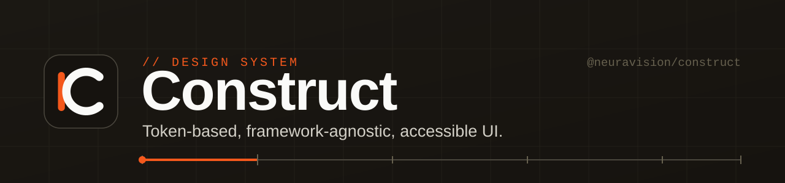

<div align="center">

[](https://samyssmile.github.io/construct/)

# Construct

**A token-based, framework-agnostic design system for accessible, modern web UI.**

[](https://www.npmjs.com/package/@neuravision/construct)
[](https://www.npmjs.com/package/@neuravision/construct)
[](https://samyssmile.github.io/construct/)
[](https://github.com/Samyssmile/construct/actions/workflows/deploy-storybook.yml)
[](docs/guidelines.md)
[](LICENSE)
[](CONTRIBUTING.md)

[**Live Storybook**](https://samyssmile.github.io/construct/) · [Components](#-components) · [Design Tokens](#-design-tokens) · [Accessibility](#-accessibility) · [Contributing](CONTRIBUTING.md)

</div>

---

## Why Construct?

Construct is a **single source of design truth** that ships as plain CSS and design tokens — no runtime, no framework lock-in. Style values live once as JSON tokens and compile to CSS custom properties, JSON, and typed TypeScript exports. Components are pure CSS classes (`ct-` prefix), so they work with vanilla HTML, Angular, React, Svelte, or anything that renders markup.

- 🎯 **Token-driven** — colors, spacing, typography & radii defined once, consumed everywhere
- 🧩 **Framework-agnostic** — 47 components as portable CSS, zero JS dependencies
- ♿ **Accessibility first** — WCAG 2.1 AA, full keyboard support, ARIA, focus management
- 🎨 **Three themes** — `light`, `dark`, `high-contrast`, with system-preference fallback
- 📐 **The "datum" grammar** — a signature orange reference line for focus / active / current state
- 🛠️ **Typed tokens** — autocomplete-friendly TypeScript exports
- 📖 **Interactive docs** — every component documented & a11y-tested in [Storybook](https://samyssmile.github.io/construct/)

## 📦 Installation

```bash
npm install @neuravision/construct
```

Using Angular? Reach for the official wrapper [**@neuravision/ng-construct**](https://github.com/Samyssmile/ng-construct) — typed, signal-based components built on top of these styles.

## 🚀 Quick Start

Import the foundation styles and the component bundle once (e.g. in your global stylesheet):

```css
@import "@neuravision/construct/foundations.css";
@import "@neuravision/construct/components/components.css";
```

Then use the classes in your markup:

```html
<button class="ct-button">Primary</button>
<button class="ct-button ct-button--secondary">Secondary</button>

<div class="ct-field">
  <label class="ct-field__label" for="email">Email</label>
  <input class="ct-input" id="email" type="email" placeholder="name@company.com" />
</div>
```

Or build custom UI directly on the tokens:

```css
.custom-card {
  background: var(--color-surface);
  color: var(--color-text);
  padding: var(--space-4);
  border-radius: var(--radius-control);
}
```

> 💡 Need a smaller bundle? Import only what you use — every component is also a standalone file,
> e.g. `@import "@neuravision/construct/components/button.css";`

## 🎨 Theming

Set `data-theme` on the root element (or any container) to switch modes:

```html
<html data-theme="dark"> … </html>
```

| Value | Description |
|-------|-------------|
| `light` | Default theme |
| `dark` | Dark theme |
| `high-contrast` | Maximum-contrast theme |

With **no** `data-theme` set, Construct respects system preferences automatically:
`prefers-color-scheme: dark` → dark, `prefers-contrast: more` → high-contrast.

## 🧩 Components

47 production-ready components, each documented and accessibility-tested in [Storybook](https://samyssmile.github.io/construct/).

| Category | Components |
|----------|-----------|
| **Actions** | Button · Toggle Group · Toolbar |
| **Forms & Inputs** | Field · Input · Textarea · Select · Select Menu · Checkbox · Radio · Switch · Slider · Combobox · Chip · File Upload · Datepicker |
| **Data Display** | Table · Data Table · List · Tree · Avatar · Badge · Icon · Tooltip · Chart |
| **Feedback** | Alert · Banner · Toast · Spinner · Skeleton · Progress Bar · Empty State |
| **Navigation** | Navbar · Breadcrumbs · Tabs · Pagination · Sidebar · Skip Link |
| **Overlays** | Modal · Drawer · Popover · Dropdown |
| **Layout** | Card · Divider · Accordion · App Shell · App Shell V2 |

→ [**Explore every component in the live Storybook**](https://samyssmile.github.io/construct/)

## 🎨 Design Tokens

Construct uses a **two-tier token system**: raw *primitives* and contextual *semantic* aliases.

```jsonc
// primitives — raw values
{ "color": { "orange": { "500": "#F4581C" }, "stone": { "950": "#16130F" } }, "space": { "4": 8 } }

// semantic — contextual aliases that reference primitives
{ "color": { "brand": { "primary": "{color.stone.950}", "accent": "{color.orange.500}" } } }
```

The build pipeline (`npm run build`) compiles `tokens/*.json` into:

- **`tokens.css`** — CSS custom properties (`--color-brand-accent`)
- **`tokens.json`** — resolved values for tooling
- **`tokens.ts` / `tokens.js`** — typed exports

> ⚠️ Never hand-edit generated files (`tokens/tokens.*`). Edit the source JSON and run `npm run build`.

## ♿ Accessibility

Accessibility is a first-class requirement, not an afterthought:

- ✅ Semantic HTML & correct ARIA attributes
- ✅ Full keyboard navigation (roving tabindex, focus traps, arrow-key patterns)
- ✅ Visible focus indicators (the orange "datum")
- ✅ WCAG 2.1 AA contrast across all three themes
- ✅ Screen-reader support & live regions for dynamic content
- ✅ Respects `prefers-reduced-motion`

The Storybook a11y addon is configured to **fail the build on violations**. See [docs/guidelines.md](docs/guidelines.md) for the detailed patterns.

## 🧰 Tech & Tooling

| | |
|---|---|
| **Distribution** | Plain CSS + design tokens (no runtime) |
| **Docs & tests** | Storybook 10 · Vitest 4 · Playwright (story-driven) |
| **a11y testing** | `@storybook/addon-a11y` (fails on violations) |
| **Token build** | Custom pipeline (`scripts/build-tokens.mjs`) |

## 🛠️ Local Development

```bash
npm install              # install dependencies
npm run storybook        # dev server → http://localhost:6006
npm run build            # build token outputs
npm run check            # verify token outputs are up to date (CI)
npx vitest --run         # run tests headless
```

## 🎯 Framework Support

| Framework | Status |
|-----------|--------|
| **Vanilla HTML / CSS** | ✅ Available — use the `ct-` classes directly |
| **Angular** | ✅ Available — [`@neuravision/ng-construct`](https://github.com/Samyssmile/ng-construct) |
| **React** | 🛣️ Planned |
| **Svelte** | 🛣️ Planned |

## 📖 Documentation

- [Design Guidelines](docs/guidelines.md) — do's, don'ts & accessibility patterns
- [Component Usage](components/README.md) — HTML patterns and examples
- [Token Reference](tokens/README.md) — token structure & naming
- [Changelog](CHANGELOG.md) — release history

## 🤝 Contributing

Contributions are welcome! Please read the [Contributing Guide](CONTRIBUTING.md) and our
[Code of Conduct](CODE_OF_CONDUCT.md) before opening a PR. Found a security issue? See [SECURITY.md](SECURITY.md).

## 📄 License

[MIT](LICENSE) © Construct contributors

---

<div align="center">
<sub>Built with accessibility and modern design principles in mind · <a href="https://samyssmile.github.io/construct/">Live Storybook</a></sub>
</div>
