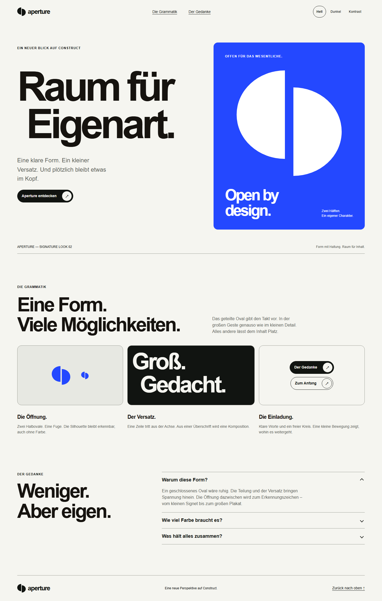
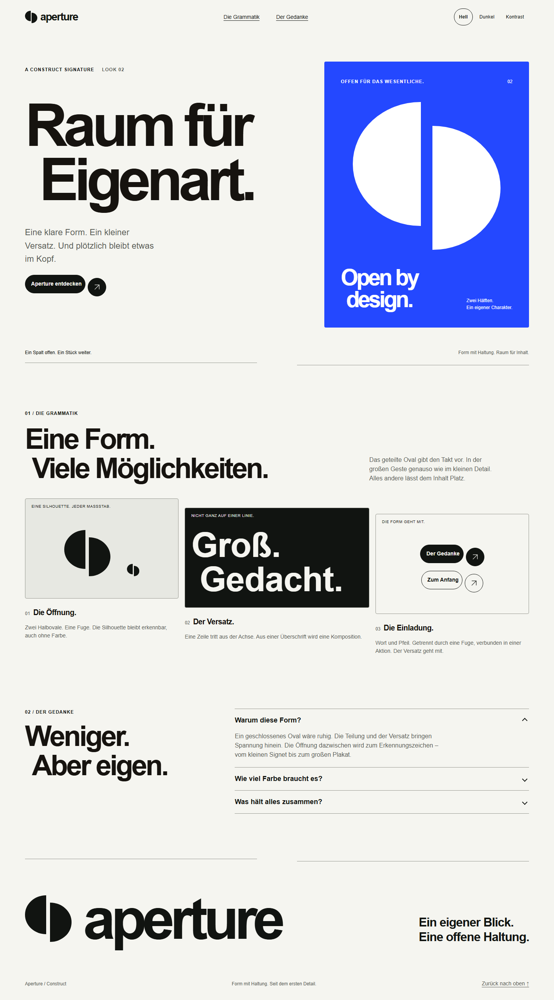

# Aperture – Review und Politur

Stand: 16. September 2026. Grundlage ist die vorhandene Aperture-Fassung im
Arbeitsverzeichnis, visuell geprüft in der lokalen Vorschau und in Storybook.

## Einschätzung

Das geteilte, versetzte Oval ist der stärkste Identitätsträger. Die Kombination
aus Papier, Kobalt und großer Groteskschrift gibt ihm einen überzeugenden Rahmen.
Der ursprüngliche Einstieg funktioniert bereits gut. Im weiteren Seitenverlauf
wird die Formidee jedoch kaum fortgeführt: gleichförmige runde Karten, ein üblicher
Pillen-Button und ein kleiner Footer schwächen die Eigenständigkeit.

Die Politur macht **Fuge und Versatz** zu einer wiederkehrenden Gestaltungsregel.
Die Einschätzung zur Wiedererkennung ist ein Designurteil; eine Messung mit
Nutzern oder ein Vergleich mit anderen Marken war nicht Teil dieses Durchgangs.

## Befunde und Änderungen

| Befund | Umsetzung |
| --- | --- |
| Die Signatur steckt hauptsächlich im großen Signet. | Geteilte Trennlinien übernehmen die 46/8/46-Proportion; zweite Überschriftszeilen treten wiederkehrend aus der Achse. |
| Der Pfeil wirkt wie ein Standarddetail innerhalb einer Pille. | Beschriftung und Pfeilscheibe erhalten eine echte Fuge und einen vertikalen Versatz. Beides bleibt eine gemeinsame Klickfläche und ein Tastaturziel. |
| Drei gleich ausgerichtete, stark gerundete Karten wirken austauschbar. | Ruhigere 4-px-Radien, gestaffelte Musterflächen, größere monochrome Formstudie und präzisere Typografie innerhalb der jeweiligen Fläche. Auf kleinen Breiten entfällt die Staffelung. |
| Der Abschluss besitzt wenig visuelles Gewicht. | Eine große Wort-Bild-Marke und ein kurzer Leitsatz schließen die Komposition ab. |
| Globale Link-Hover-Farben können die helle Beschriftung auf dunklen Aktionen überschreiben. | Aperture erhält explizite Hover-/Aktivfarben; ein Storybook-Test prüft den Kontrasterhalt. |
| Versetzte Aktionen benötigen eine saubere Spiegelung in RTL. | Logische Innenabstände halten die Fuge offen; ein Geometrietest sichert sie ab. Disclosure-Pfeile zeigen auch in RTL nach unten beziehungsweise oben. |
| Der fokussierte Sprunglink-Zielbereich übernimmt die orange Foundation-Markierung. | Der Inhaltsfokus folgt jetzt der Aperture-Tintenfarbe. |

Das Oval selbst, seine Fuge und seine Proportionen bleiben erhalten. Kobalt
konzentriert sich auf die Hauptfläche. Die neue monochrome Story zeigt, wie die
Komposition ohne den Farbakzent funktioniert. Neue öffentliche Bausteine sind
`ct-aperture-line` und `ct-aperture-rule`; die Komposition bleibt im Beispiel-CSS.

## Bildvergleich

| Vorher, 1440 px | Nachher, 1440 px |
| --- | --- |
|  |  |

Weitere Ansichten: [Mobil, 390 px](assets/aperture-review/after-mobile.png) ·
[Monochrom](assets/aperture-review/after-monochrome.png).

## Verifikation

- `npm run build` und `npm run check`: erfolgreich, einschließlich Token-, Kontrast-, CSS- und Exportprüfungen.
- `npm test`: 447 bestandene Tests – 56 Behavior-, 378 Storybook-, 6 Touch- und 7 Forced-Colors-Tests; darunter 10 Aperture-Stories.
- `npm run storybook:build`: erfolgreich. Vite meldet Hinweise zu Chunk-Größen und Plugin-Laufzeiten.
- Zusätzliche Chromium-Prüfung: 320, 360, 390, 600, 850, 851, 900, 1024, 1440 und 1920 px in allen vier Themes; kein horizontaler Überlauf in diesen 40 Kombinationen.
- Zusätzlich geprüft: RTL-Layout, lange Aktionsbeschriftungen, Sprunglink und Tastaturfokus, unbewegter Pfeil bei reduzierter Bewegung sowie 200 % Textgröße bei 720 px Fensterbreite.
- Visuell kontrolliert: Desktop, Mobil, Zwischenbreite, Dark, High Contrast Dark, Forced Colors, RTL, Monochrom und vergrößerter Text.

Screenshots dokumentieren den lokalen Chromium-Stand. Die automatisierten
Accessibility-Prüfungen ersetzen keine vollständige manuelle Prüfung mit
Screenreader oder in weiteren Browsern.
